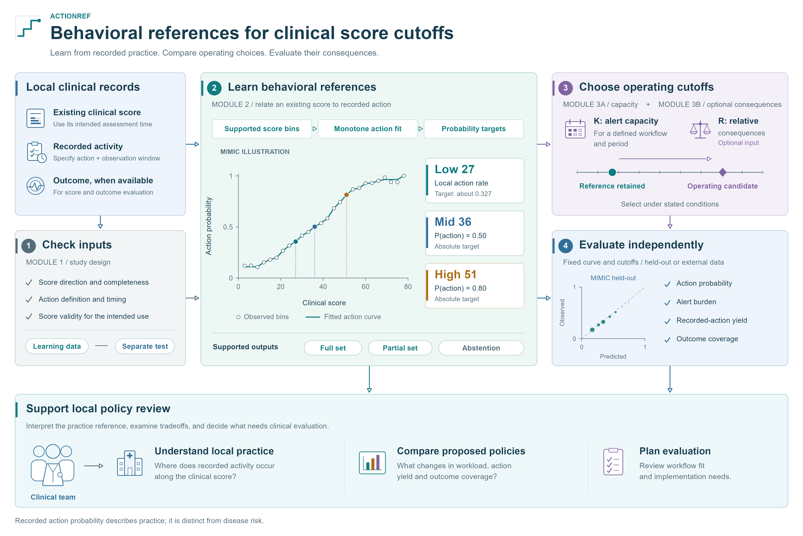
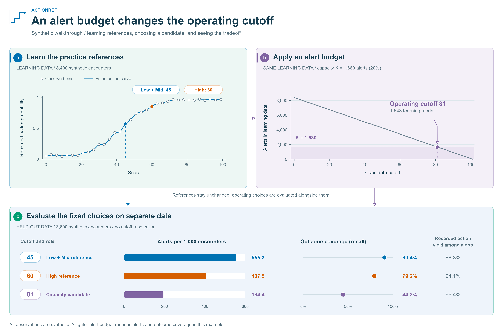

# ActionRef

**Connect clinical scores to observed practice, then make threshold trade-offs explicit.**

ActionRef learns interpretable reference thresholds from the relationship between an
existing score and recorded clinical actions. Teams can use those references to
understand local practice, examine alert workload, and compare candidate thresholds
under a stated capacity or consequence scenario.

The Python package is `universal-cutoff`; the import is `universal_cutoff`.
Software version: **1.0.1** · [MIT license](LICENSE).

[Get started](docs/quickstart.md) · [Prepare your data](docs/data.md) ·
[Interpret references](docs/references.md) · [API](docs/API_REFERENCE.md) ·
[Clinical example](docs/clinical-example.md) · [Reproduce the paper](docs/paper-reproduction.md)



[Zoomable SVG](docs/assets/figures/workflow.svg) · [PDF](docs/assets/figures/workflow.pdf) ·
[R figure sources and reproduction](docs/figures.md)

## What does ActionRef answer?

| Question | Output |
|---|---|
| How do recorded actions vary across a score? | An empirical action curve with sample support. |
| Which score values have interpretable behavioral meaning? | Low, Mid, and High references with their probability targets and provenance; partial output or abstention when appropriate. |
| What fits a team's alert budget? | Capacity-adjusted operating candidates that retain the original references. |
| What changes if a candidate is used? | Alert burden, recorded-action yield, outcome coverage, and optional scenario-weighted loss. |

An action probability describes recorded practice. A disease risk describes an
outcome. ActionRef keeps those quantities separate. Capacity and consequence
analyses support a local decision; they do not turn recorded practice into a
treatment recommendation.

## Quick start

Clone the repository and install in a Python environment:

```bash
git clone https://github.com/Sheldon0106/ActionRef.git
cd ActionRef
python -m pip install -e ".[test]"
python examples/synthetic_walkthrough.py --output-dir output/synthetic
```

The example creates **12,000 synthetic encounters**, learns references on 8,400,
and evaluates the same references and capacity candidates on the remaining 3,600.
It needs no clinical data or downloads after installation.

```text
Learned references
Low     45    absolute
Mid     45    absolute
High    60    absolute
```

Low and Mid coincide in this example. They keep their different meanings while
sharing one operating threshold. A budget of 1,680 alerts in the learning cohort
maps the available references to a candidate of 81. Held-out alert burden is then
measured without refitting; the original budget is not a guarantee for a new cohort.

The script saves `references.csv`, `learning_curve.csv`, `capacity.csv`,
`heldout.csv`, and `summary.json`. See the [walkthrough](docs/quickstart.md) for
the code, output definitions, and missing-data rules.



## Use your own score

Supply one row per encounter and a numeric score whose higher values indicate
greater concern. Module 2 also needs a binary recorded-action label; outcome
labels are optional and enable outcome evaluation and consequence analysis.

```python
import pandas as pd
from universal_cutoff import fit_behavior_thresholds, evaluate_frozen_thresholds

learning = pd.read_csv("data/learning.csv")
evaluation = pd.read_csv("data/evaluation.csv")

references = fit_behavior_thresholds(learning, "score", "response")
print(references.anchors[["level", "selected_threshold", "provenance_tier"]])

# Evaluate only when at least one reference is available.
if references.anchors.selected_threshold.notna().any():
    report = evaluate_frozen_thresholds(
        evaluation, "score", references.anchors,
        response_col="response", outcome_col="outcome",
    )
    print(report.table)
```

Prepare separate learning and evaluation cohorts before calling these functions.
For repeated encounters, split by patient. Define the action components, their
observation windows, and missingness before interpreting the references.
[Data contract →](docs/data.md)

## Follow the workflow

1. **Check the score and inputs.** Review completeness, score orientation, and optional outcome performance.
2. **Learn behavioral references.** Inspect the observed action curve, targets, and evidence support.
3. **Compare operating candidates.** Apply a capacity budget; add consequence scenarios when relevant.
4. **Evaluate on separate data.** Report workload, action yield, and outcome coverage for fixed thresholds.

The [clinical example](docs/clinical-example.md) illustrates the MIMIC sepsis
references 27 / 36 / 51 and a separate candidate-comparison question. These values
belong to that analysis; the software learns references for the supplied data.

## Documentation and repository

The paper centers on **sepsis ESRP**, with **COPD** as an additional main-text
application. The **HEART-derived AERT score** is an exploratory example in the
Supplement:

| Application | Evidence and source |
|---|---|
| Sepsis ESRP | MIMIC references 27 / 36 / 51; Stanford local re-estimation 26 / 36 / 50; candidate 31 under R = 11,299/804. See the [primary results](docs/paper-results.md). |
| COPD | Additional main-text application, with corrected recorded actions, references 17.7798 / 55.0719 / unavailable, and evaluation conditional on the supplied score. [Corrected aggregates](results/copd/validation_v2_corrected/README.md) support eTables 20–22, 39 and 41. |
| HEART-derived AERT | Supplementary exploratory example of short-discrete reference learning, response-definition sensitivity and shared thresholds. [Aggregate results and executable reproduction](results/aert/README.md) support eMethods 1–2, eTables 32–34 and 38, and Supplementary Data 1–2. |

AKI and pneumonia materials remain as software development and compatibility
records; they are not reported in the paper. The [evidence guide](docs/evidence.md)
distinguishes these records from the reported applications.

Two routes through the repository:

- **Use ActionRef on your data:** follow the [synthetic walkthrough](docs/quickstart.md),
  [data contract](docs/data.md), and [output-state examples](docs/output-states.md).
- **Examine the paper evidence:** follow the [reproduction guide](docs/paper-reproduction.md)
  and [primary result tables](docs/paper-results.md). Shared aggregate counts rebuild
  Table 3 and eTables 35–37. COPD and AERT have separate aggregate reproduction
  commands; the sepsis analysis runner accepts authorized clinical analysis tables.

```bash
python examples/reproduce_paper.py
python examples/reproduce_additional.py
python examples/reproduce_aert.py
```

The documentation is built with MkDocs Material and includes a workflow overview,
tutorials, clinical examples, and API guidance.
All repository figures are drawn in R/grid from original vector artwork
and saved aggregate inputs. [Rebuild the figures](docs/figures.md) or edit their
[R sources](scripts/figures/).

```bash
python -m pip install -r requirements-docs.txt
python -m mkdocs serve
```

| Location | Contents |
|---|---|
| [`src/universal_cutoff/`](src/universal_cutoff/) | Package APIs and method implementation |
| [`examples/`](examples/) | Synthetic walkthrough and clinical-data runners |
| [`docs/`](docs/index.md) | Tutorials, interpretation, API, and analysis notes |
| [`configs/`](configs/) | Declared disease and analysis configurations |
| [`results/`](results/) | Aggregate research outputs; see the [evidence guide](docs/evidence.md) for analysis roles |
| [`scripts/`](scripts/) | Figure generation and public-repository checks |
| [`tests/`](tests/) | Synthetic tests of software behavior |

## Reproducibility, data, and citation

The core package supports Python 3.8 and newer. Documentation tooling uses Python
3.11 or newer. Run `python -m pytest` for the software tests; see
[Contributing](CONTRIBUTING.md) for the full build and documentation checks.

Clinical encounter data are not distributed here. Public examples use synthetic
data, and research artifacts contain aggregate outputs. The package supports
retrospective analysis and local evaluation; clinical deployment requires evaluation
of the proposed workflow in its intended setting.

For software citation, record the repository URL, package version, and commit used.
[CITATION.cff](CITATION.cff) provides the software citation metadata.
