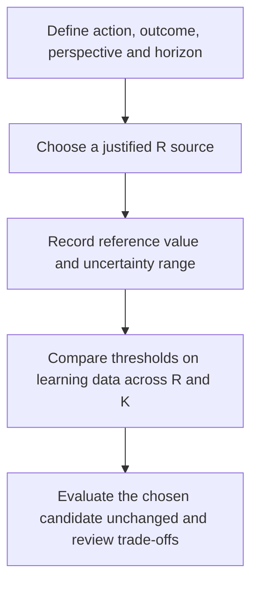

# Setting R for a specified workflow

`R = C_FN / C_FP` — modeled relative consequence of one missed outcome-positive case versus one false alert.

- Never estimated from prevalence.
- Never selected to favor a preferred cutoff.

## Five-step workflow (Supplement eMethods 3)

1. **Define the decision.** Specify the triggered action, target outcome,
   stakeholder perspective and time horizon. Distinguish the proposed workflow
   from the recorded-action label used to learn behavioral references. Specify
   K separately, with its task, team and period.
2. **Choose a defensible source.** Use commensurate, independently valued FN/FP
   consequences, structured stakeholder elicitation, or a comparable published
   decision threshold. The optional tier recommender supplies a low-confidence
   scenario when a setting-specific basis is unavailable. Capacity mapping alone
   requires no R.
3. **Record the reference value and range.** Preserve sources, assumptions and
   uncertainty. R is a consequence ratio, not an outcome prevalence or a score
   cutoff. Do not choose its value to obtain a preferred candidate.
4. **Evaluate sensitivity on learning data.** For each prespecified R, minimize
   `FAE = FP + R * FN` over thresholds using `score >= t`, both without a capacity
   constraint and under the stated K. Module 3B resolves loss ties in favor of
   more alerts, then the lower threshold. Report the selected thresholds, grid
   stability, workload and outcome coverage. A grid stability band is neither a
   continuous analytical interval nor a statistical confidence interval.
5. **Evaluate the chosen candidate unchanged.** Apply the learning choice to
   evaluation data and present benefits and costs together. A fixed pair's loss
   crossing is a different question from threshold re-selection. Document the
   workflow and review the trade-off with its stakeholders.



### Reported primary sepsis example

The reference value is **R = 11,299/804 = 14.0534825870647** for the proposed
diagnostic/short-course antibiotic workflow. The Low-27 comparison ceiling is
**K = 109,888 alerts in 297,476 score-complete learning encounters**. It is a
reference workload ceiling, not measured staffing capacity. The observed action
composite used in Module 2 has a different definition.

| R | Unconstrained learning optimum | Optimum under the Low workload ceiling |
|---:|---:|---:|
| 1 | 66 | 66 |
| 5 | 43 | 43 |
| 10 | 34 | 34 |
| 11–14.05 (evaluated grid nodes) | 31 | 31 |
| 15 | 28 | 28 |
| 20 | 26 | 28 |
| 30 | 26 | 27 |
| 100 | 17 | 27 |

The exact reference value is included in the grid. `ratio_invariance()` returns
31 at the reference value in both capacity conditions, with a contiguous matching
grid run from 11 to 14.0534825870647. The next evaluated value, 15, selects 28;
these results do not locate the exact continuous transition. The full selection
grid and the two invariance rows are shared in `results/sepsis_primary/` and
described in **Supplement eMethods 3**. **eTable 37** contains only the fixed
31-versus-27 evaluation comparison.

For prepared learning data, the package call is:

```python
from universal_cutoff import build_threshold_table, ratio_invariance

table = build_threshold_table(learning_df, "score", outcome_col="outcome")
grid = [1, 2, 3, 4, 5, 6, 7, 8, 9, 10, 11, 12, 13, 14, 14.05348,
        15, 16, 17, 18, 19, 20, 22, 25, 30, 40, 50, 75, 100]
result = ratio_invariance(
    table, 11299 / 804,
    k_fracs=[None, 109888 / 297476], ratio_grid=grid,
)
print(result.to_string(index=False))
```

Use the primary partition and its separately constructed outcome labels; source
columns from another export can have a different outcome definition. The
[paper data contract](paper-data.md) describes the required analysis inputs.

## Primary route: natural-frequency elicitation

### Frame (required first)

`ElicitationFrame` enforces all four. `build_r_guidance` raises if a frequency elicitation omits them.

| Field | Question |
|---|---|
| `intended_action` | What action does crossing the threshold trigger? |
| `target_outcome` | What is the target outcome, as the score identifies it? |
| `stakeholder_perspective` | Whose perspective is being elicited? |
| `time_horizon` | Over what time horizon is the outcome assessed? |

### Trade-off question

```text
Suppose lowering the threshold identifies 1 additional patient who experiences Sepsis-3,
while also triggering clinical reassessment for 9 additional patients who do not
experience Sepsis-3. Considering the expected benefits, harms, workload, and a time
horizon of 6 hours, would you accept this tradeoff?
```

- No causal treatment effect is estimated.
- No patient is described as benefiting.
- No action is described as unnecessary.
- Field names follow the same rule: `additional_outcome_positive`, `additional_outcome_negative`, `accepted`.

### Point estimate

```text
R_primary = sqrt(R_largest_accepted * R_smallest_rejected)
```

- Accepted scenario sets the lower bound. Rejected sets the upper bound.
- Report as the geometric (log-scale) midpoint of the elicited switch interval.
- Not an estimate of the true R. `point_estimate_basis` states this in the output.
- The interval carries the uncertainty. The grid spans it.
- Confidence is forced to low whenever elicitation determines the primary value.

Example: accept 13, reject 19 → range `13`–`19`, primary `15.72`, `scenario_assumption`, low confidence.

### Unbracketed and inconsistent responses

Ladder: opens at 9. Tests 19 after an acceptance, 4 after a rejection. Then targets the geometric midpoint.

| `bracketing_status` | Condition | Result |
|---|---|---|
| `bracketed` | Accepted and rejected straddle R | Primary R, range, grid |
| `one_sided_lower` | All accepted | No primary R; warning gives the floor |
| `one_sided_upper` | All rejected | No primary R; warning gives the ceiling |
| `inconsistent` | Harder accepted, easier rejected | No primary R; warning requests review |

- Last three return `insufficient_basis`, `recommended_R_primary = None`.
- None raises.
- The ladder halts on `inconsistent`.

## Alternate routes

**Published-threshold tier recommender.** When Module 3B is required but no local
cost build or elicitation is available, `recommend_ratio()` offers a prespecified,
low-confidence scenario value from one of three decision tiers. The tier is chosen
from the consequence of a miss and the burden/risk of the triggered action, not from
the disease name. `ratio_invariance()` and `ratio_band_impact()` then test the tier
band on the local threshold-level confusion table. See
[`RATIO_RECOMMENDER_FINDINGS.md`](RATIO_RECOMMENDER_FINDINGS.md).

- It is not an estimate of the true R and does not establish clinical utility.
- Its invariance band is a discrete-grid sensitivity result, not a confidence interval.
- `1 + R` is a break-even threshold-odds interpretation, not empirical PPV or causal NNT.
- If local stakeholders are available, the framed natural-frequency route above remains
  the stronger setting-specific justification.
- Capacity-only Module 3A users do not need R.

**Independently valued consequences.** One commensurate unit across FN and FP. Mixed units and duplicate names rejected.

```text
R      = sum(FN components) / sum(FP components)
R_low  = sum(FN lower) / sum(FP upper)
R_high = sum(FN upper) / sum(FP lower)
```

**Elicited action threshold probability.** `p_t` = outcome probability at which the action becomes worthwhile.

```text
R      = (1 - p_t) / p_t
R_low  = (1 - p_high) / p_high
R_high = (1 - p_low) / p_low
```

- `p_t = 0.10` implies `R = 9`.
- This is an action threshold probability. Not a score threshold. Not a Low/Mid/High candidate.

**Direct R entry.** Available for prespecified analyses such as the primary sepsis
`R=11299/804` scenario. Historical development reports also contain an `R=15`
scenario; it is separate from the current primary paper value.

## Outputs

Returns:

`recommended_R_primary`, `recommended_R_range`, `recommended_R_grid`,
`point_estimate_basis`, status, provenance, confidence, warnings, rationale

- Status values: `evidence_based`, `consensus_based`, `locally_costed`, `scenario_based`, `insufficient_basis`.
- Source types: expert elicitation, Delphi elicitation, published evidence, local costing, stakeholder preference, policy, scenario assumption.
- Module 3B decision-transition R values may extend the grid after primary and range are fixed. Out-of-range values excluded. They cannot change the primary R.

## Optional minimax regret

```text
loss(t, r)   = FP(t) + r * FN(t)
regret(t, r) = loss(t, r) - min_s loss(s, r)
```

- Selects the feasible threshold with the smallest maximum regret over a fixed R grid.
- Does not choose or estimate R.
- Cannot define, relabel, or replace Low/Mid/High.

## Safeguards

- Prevalence-based and threshold-tuned rationales rejected.
- Primary value without uncertainty bounds warns.
- Scenario assumptions set to low confidence.
- Currency interpretation requires both FP and FN monetary consequences independently defined.
- Expected binding capacity triggers the budget-bound-retention warning.
- K is context and binding audit only. It does not enter either R equation.
- R guidance is separate from Module 2. It cannot define, replace, or relabel Low/Mid/High.

## Method sources

- Vickers and Elkin 2006 — action threshold probability versus relative FP/FN harms.
- Pauker and Kassirer 1980 — testing and treatment thresholds.
- Bojke et al. 2021 — structured expert elicitation reference protocol.
- Soares et al. 2024 — ISPOR report; SHELF, Cooke, IDEA, modified Delphi, MRC.
- Valentine et al. 2023 — direct, threshold-technique, and discrete-choice methods gave materially different results.
- Manski 2007 — adaptive minimax-regret treatment choice.
- Hoffrage et al. 2015 — natural frequencies beat probability presentations.
- Jacobs et al. 2023 — no gold standard exists.
