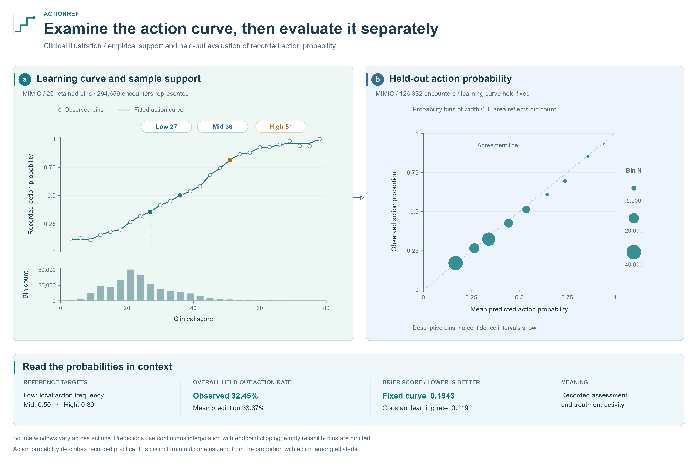

# Figure sources and reproduction

All figures are drawn in **R/grid**, with editable text and vector shapes.
`scripts/build_figures.R` assembles the panels in `scripts/figures/`. The scientific
regions, clinical icons, curves, and comparison charts share one visual system.

Exports include SVG, vector PDF, and **300-dpi PNG**. The 16-inch-wide canvas is
intended for a zoomable repository figure; a journal column-size version would
need its own layout. Text is at least 9 pt at the exported physical size.

With R 4.4 or newer, run from the repository root:

```bash
Rscript -e "install.packages(c('jsonlite', 'svglite', 'ragg'), repos='https://cloud.r-project.org')"
Rscript scripts/build_figures.R
```

The committed aggregate inputs make this build independent of clinical records or
Python plotting libraries. Arial is used when installed, with Liberation Sans or
DejaVu Sans as alternatives. Each panel is also exported to `output/figures/` for
inspection. Add `--preview` to create smaller screen-only QA previews there.

To regenerate the **synthetic aggregates** from the original Python demonstration:

```bash
python -m pip install -e .
python scripts/prepare_figure_data.py
Rscript scripts/build_figures.R
```

## Workflow overview


**Message:** empirical references, operational choices, and independent evaluation
have distinct roles. The central curve uses the saved MIMIC learning bins, and the
small reliability inset uses MIMIC held-out observations. Their sources are listed
below. The operating-cutoff ruler and clinical icons are conceptual, without
numerical performance claims. Full, partial, and abstention outputs remain visible.

Low 27, Mid 36, and High 51 illustrate this analysis's attainable absolute targets:
the local background action rate (about 0.327), 0.50, and 0.80. Each is the first
supported fitted bin reaching its target, so its fitted probability need not equal
the target exactly. Other datasets can yield different references, relative targets,
or unavailable outputs; see [reference interpretation](references.md).

[SVG](assets/figures/workflow.svg) · [PDF](assets/figures/workflow.pdf)

## Synthetic walkthrough


**Message:** learning a reference and imposing an alert budget produce different
outputs, whose workload and outcome coverage are evaluated on separate data.

Inputs come from `examples/synthetic_walkthrough.py`, seed 719 and split seed 2026,
exported by `scripts/prepare_figure_data.py` into `docs/assets/data/synthetic_*`.
[Checksums](assets/data/synthetic_provenance.json) identify the saved aggregates.

The top row shows the learned action curve and learning-data alert counts across
candidate cutoffs. The pale purple region marks alert counts at or below K = 1,680.
The capacity candidate of 81 produces 1,643 learning alerts; it leaves the original
references at 45 / 45 / 60. The bottom row compares alerts, outcome coverage, and
recorded-action yield in 3,600 separate synthetic encounters. These values are
calculated from the saved table. No confidence intervals are displayed.

[SVG](assets/figures/synthetic-example.svg) · [PDF](assets/figures/synthetic-example.pdf)

## Clinical action illustration



**Message:** the learned score–action relationship can be examined alongside sample
support and evaluated on held-out action observations.

- [Learning curve](assets/data/sepsis_learning_curve.csv): saved semantic response curve
  from run `run_20260901T114212647018Z_7a68fbe37684`.
- [Reliability bins](assets/data/sepsis_action_reliability.json) and
  [evaluation metrics](assets/data/sepsis_action_points.json): saved held-out action
  evaluation from run `run_20261002T082847Z_history_action_calibration`.
- [Source hashes](assets/data/provenance.json): checksums and original filenames.

The learning curve is plotted exactly from the saved bin coordinates and fitted
rates. Held-out prediction uses continuous interpolation of the fixed curve with
endpoint clipping. The reliability panel uses fixed 0.1-wide probability bins,
omits empty bins, and scales point area by count. The additional bin-assignment
sensitivity result remains in the source JSON but is not plotted. Counts refer to
encounters, not unique people. No uncertainty bands have been added.

The lower band reports the absolute reference targets and saved held-out action
metrics. Brier score compares predicted probabilities with recorded actions; the
constant comparator uses the complete learning cohort's background action rate.
This is an assessment of recorded-action prediction, separate from outcome-risk
prediction or clinical benefit. The composite action retains its heterogeneous
source windows, detailed in the [clinical example](clinical-example.md).

The [primary result tables](paper-results.md) report the Brier interval and paired
difference from the constant comparator. They use patient-cluster resampling
conditional on the learned curve; these are separate from reference-relearning intervals.

Low, Mid and High consistently use blue (#0072B2), green (#009E73) and orange
(#D55E00). Operating candidates use purple. The shared color mapping is recorded
in `configs/figure_palette.json`; all R figures read it.

[SVG](assets/figures/clinical-action.svg) · [PDF](assets/figures/clinical-action.pdf)

## COPD partial output


**Message:** a retained Low/Mid pair with an unavailable High is a valid reference
output. The [corrected curve and anchors](https://github.com/Sheldon0106/ActionRef/blob/v1.0.1-jamia-submission/results/copd/validation_v2_corrected/README.md)
provide every plotted coordinate. All 28 supported learning bins are shown; point
area follows bin encounter count. The orange cross identifies the rejected crossing
at bin 50, and the orange horizontal line identifies its relative target 0.4278.
The Low and Mid vertical lines locate the actual retained score thresholds.
No bootstrap median is substituted for High and no uncertainty band is plotted.

This single-panel figure is 8.5 by 5.5 inches with a 12/10/9-pt type hierarchy.
The other figures retain their 16-inch repository layouts. See
[output interpretation](output-states.md#real-data-partial-output-copd) for the
action definition and ordering rule.

[SVG](assets/figures/copd-partial-output.svg) · [PDF](assets/figures/copd-partial-output.pdf)
