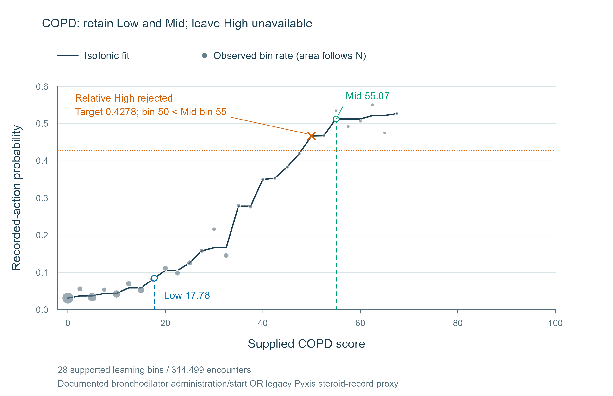

# Full, relative, partial and unavailable references

A useful result need not contain three distinct numeric thresholds. This small
example shows how to read the available levels and their provenance together.

```bash
python examples/reference_states.py
```

Each scenario contains 10,100 synthetic encounters on the same score range.
The response patterns are deterministic teaching examples, not clinical findings.

| Scenario | Low | Mid | High | Interpretation |
|---|---|---|---|---|
| Absolute references | 51 (A) | 54 (A) | 87 (A) | All absolute probability targets are attainable |
| Relative references | 51 (A) | 51 (B) | 81 (B) | Absolute 0.50 and 0.80 are outside the fitted range; the prespecified relative targets are used |
| Partial references | 51 (A) | Unavailable (E) | 84 (A) | The absolute Mid crossing falls below Low; the ordering rule leaves Mid unavailable |
| Abstention | Unavailable (E) | Unavailable (E) | Unavailable (E) | The flat response pattern fails the evidence gate |

A denotes an absolute reference, B a relative reference, and E an unavailable
level. The script saves the target probability, family, status and reason for
every row in `output/reference-states/states.csv`.

In the relative example, Mid 51 describes the midpoint of the fitted action-rate
range; it does not mean 50% action probability. In the partial example, keep the
available references and the reason for the unavailable level. Do not fill the
gap with a bootstrap median or an operating candidate.

Abstention concerns support for this score–action relationship. It is not a judgment
about the clinical value of the underlying score. See [reference interpretation](references.md)
for the gates, target rules and treatment of coincident values.

## Real-data partial output: COPD

The corrected COPD action definition yields Low **17.7798** and Mid **55.0719**.
The absolute High target is outside the fitted range. Its prespecified relative
target, **0.4278**, reaches bin **50**, below Mid's bin **55**. The ordering rule
therefore leaves High unavailable, with no replacement.



[Editable SVG](assets/figures/copd-partial-output.svg) ·
[PDF](assets/figures/copd-partial-output.pdf) · [R source](https://github.com/Sheldon0106/ActionRef/blob/v1.0.0-jamia-submission/scripts/figures/copd.R)

Points show recorded-action rates in supported learning bins; the neutral line is
the fitted isotonic curve. Vertical lines locate the two retained operating
references. The orange cross marks the rejected High crossing at bin 50; the
horizontal orange line shows its relative probability target. The corrected action
is documented bronchodilator administration/start within 24 hours OR the legacy
Pyxis steroid-record proxy. Counts refer to encounters. No uncertainty band is
plotted. [Source aggregates](https://github.com/Sheldon0106/ActionRef/blob/v1.0.0-jamia-submission/results/copd/validation_v2_corrected/README.md)
support eTables 21, 22 and 39.

**Partial output is a valid result.** The 500 reference re-estimations describe
sampling variability and output availability; their High median does not replace
the unavailable full-learning High. An operating candidate likewise cannot fill
the missing behavioral-reference level.
